# Database Schema ER Diagram

This ER diagram represents the database schema for the Dakota Analytics pipeline.

## ER Diagram

```mermaid
erDiagram
    raw_eia_prices {
        bigserial id PK
        text series_id
        date period
        numeric value
        text area_name
        text area_code
        varchar product_name
        text product_code
        text process_name
        text process_code
        varchar unit
        text frequency
        text dataset
        timestamptz ingestion_timestamp
    }
    raw_energy_market_context {
        bigserial id PK
        date period
        text area_code
        numeric wti_crude_price_usd
        numeric brent_crude_price_usd
        numeric crude_spread
        numeric refinery_utilization_rate
        numeric refinery_outage_index
        numeric gasoline_inventory_million_barrels
        numeric supply_disruption_index
        numeric regional_demand_index
        numeric vehicle_miles_traveled_index
        numeric avg_temperature_c
        numeric heating_degree_days
        numeric cooling_degree_days
        numeric pipeline_utilization_rate
        numeric shipping_cost_index
        numeric energy_volatility_index
        numeric speculative_pressure_index
        numeric hurricane_risk_index
        numeric geopolitical_risk_index
        timestamptz created_at
    }
    staging_stg_eia_prices {
        text series_id PK
        date period PK
        numeric gasoline_price
        text area_code
        text area_name
        text product_code
        text product_name
        text process_code
        text process_name
        text unit
        text frequency
        timestamptz processed_at
    }
    marts_fact_gasoline_prices {
        date period PK
        text area_code PK
        text area_name
        numeric gasoline_price
        numeric wti_crude_price_usd
        numeric brent_crude_price_usd
        numeric crude_spread
        numeric refinery_utilization_rate
        numeric gasoline_inventory_million_barrels
        numeric regional_demand_index
        numeric vehicle_miles_traveled_index
        numeric avg_temperature_c
        numeric energy_volatility_index
        numeric hurricane_risk_index
        timestamptz created_at
    }
    marts_energy_market_summary {
        text area_code PK
        text area_name
        numeric avg_price
        numeric peak_price
        numeric avg_crude_price
        numeric avg_demand
        numeric avg_refinery_utilization
        timestamptz last_updated
    }
    marts_price_driver_features {
        date period PK
        text area_code PK
        numeric gasoline_price
        numeric wti_crude_price_usd
        numeric refinery_utilization_rate
        numeric gasoline_inventory_million_barrels
        numeric regional_demand_index
        numeric vehicle_miles_traveled_index
        numeric avg_temperature_c
        numeric hurricane_risk_index
        numeric energy_volatility_index
        timestamptz created_at
    }

    raw_eia_prices ||--o{ staging_stg_eia_prices : "cleaned into"
    raw_energy_market_context ||--o{ marts_fact_gasoline_prices : "enriched with"
    staging_stg_eia_prices ||--o{ marts_fact_gasoline_prices : "aggregated into"
    marts_fact_gasoline_prices ||--o{ marts_energy_market_summary : "summarized into"
    marts_fact_gasoline_prices ||--o{ marts_price_driver_features : "features extracted for"
```

## Design Rationale

- **Schemas**: Used `raw` for immutable source data, `staging` for cleaned dbt models, `marts` for final analytics and ML datasets to follow data warehouse best practices.
- **Time-Series**: `period` is DATE for weekly data; indexed for fast range queries. Added constraints to prevent invalid data.
- **Raw Tables**: Store ingested data as-is from EIA and enrichment APIs; includes audit timestamps.
- **Staging Table**: Cleaned version of EIA prices, built by dbt.
- **Marts**: Fact table for detailed analytics, summary mart for regional overviews, features mart for ML.
- **Constraints**: Check constraints for positive values and valid ranges to ensure data quality.
- **Indexes**: On period, area_code, series_id for performance; composite indexes where needed.
- **Optimization**: Used BIGSERIAL for IDs, TEXT for flexible strings, NUMERIC for precise decimals.