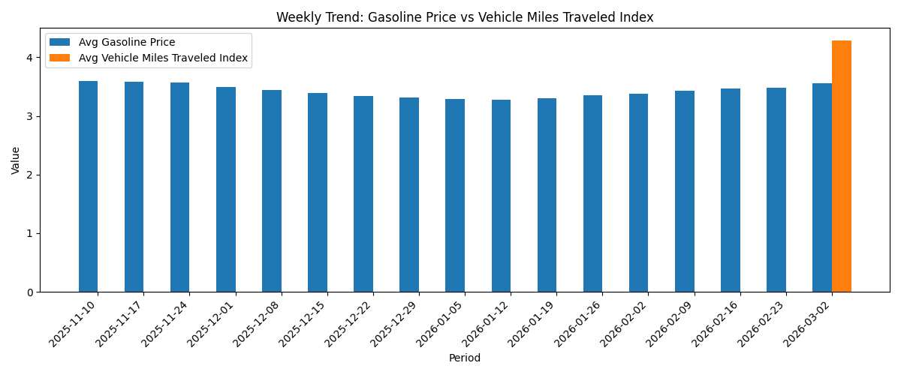

# Pipeline Health Report

Generated at: 2026-03-08T05:03:58.745012+00:00

## Executive Insights

- Latest period `2026-03-02` average gasoline price is **$3.561**.
- Highest average price region is **CALIFORNIA** at **$4.534**.
- Correlation with regional demand index: **-0.069**.
- Correlation with energy volatility index: **-0.317**.

## Row Counts

- `staging.stg_eia_prices`: 4957
- `marts.fact_gasoline_prices`: 4957
- `marts.energy_market_summary`: 29
- `marts.price_driver_features`: 4957

## Visualizations

### Weekly Trend

### Top Regions by Average Price

### Weekly Gasoline vs Vehicle Miles Bar Chart
