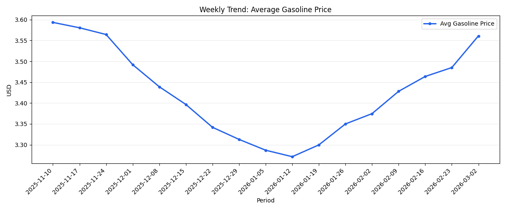
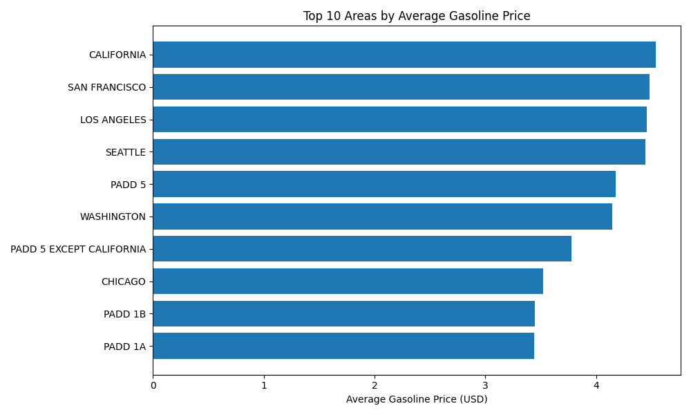
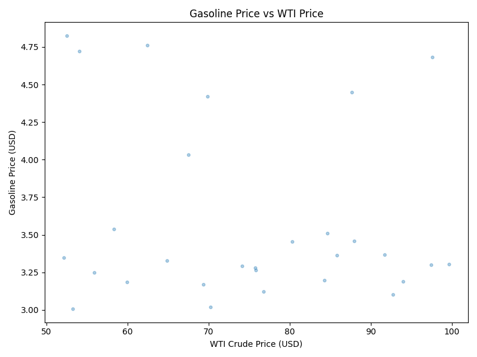

# Pipeline Health Report

Generated at: 2026-03-08T16:31:15.136028+00:00

## Executive Insights

- Latest period `2026-03-02` average gasoline price is **$3.584**.
- Highest average price region is **CALIFORNIA** at **$4.548**.
- Correlation with WTI price: **0.020**.
- Correlation with regional demand index: **0.169**.
- Correlation with energy volatility index: **-0.162**.

## Row Counts

- `staging.stg_eia_prices`: 4936
- `marts.fact_gasoline_prices`: 482
- `marts.energy_market_summary`: 29
- `marts.price_driver_features`: 482

## Visualizations

### Weekly Gasoline Price Trend

### Top Regions by Average Price

### Gasoline vs WTI Scatter
